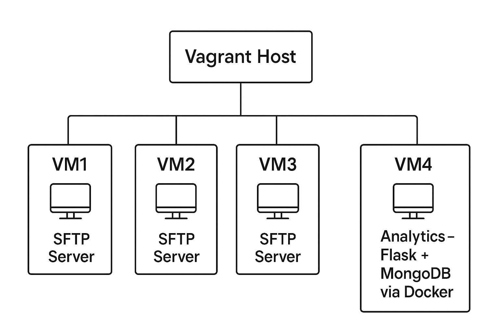

# SFTP Cluster
## Description

This system deploys a cluster of SFTP servers via Vagrant. A fourth VM hosts a reporting app that:

- Connects to SFTP VMs over SSH
- Collects logs (`from_<IP>.txt`)
- Parses and stores them in MongoDB
- Serves visual charts (Chart.js) to show write operations per IP

## Architecture



## Screenshots


## Prerequisites

- Vagrant
- VirtualBox

## Deployment Steps

### 1. Clone the repository

```bash
git clone https://github.com/Illusion4/sftp-cluster.git
cd sftp-cluster
```

### 2. Start all VMs

```bash
vagrant up
```

### 3. Access the analytics dashboard

```cpp
http://192.168.88.13:5000/
```
## Cleanup

To destroy the environment:
```bash
vagrant destroy -f
```
